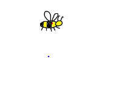

# The Bee Challenge

Difficulty: Hard  
Status: Unsolved  
Applications: Robotics, control theory, machine learning, meta learning

This problem intersects between machine learning, control theory and meta learning.

### Challenge

The challenge is to design a wing controller that
predicts the action of wing movement intelligently using rapid response
combining exploration and learning.

The ultimate goal is to make robots learn to fly on first try
while being dropped in the air, and later
handle a wide range of different environments and planning tasks.

More specificially:

- The wing controller must learn to fly on first try (extremely fast learner)
- The wing controller must handle a wide range of physical environments (flexible)
- The wing controller must use strategic learning (safe)
- The wing controller must cooperate with other wing controllers (scaleable)
- The wing controller must adapt quickly to new environments (adaptable)
- The wing controller must handle different definitions of action (versatile)
- The wing controller must assist decision making (self-modeling)
- The wing controller must make use of very little information (rational)

This problem is made hard on purpose to challenge conventional thinking about control theory. We know that the human brain uses a complex architecture for
motor control through using the cerebellum and this is used for solving general purpose tasks. This implies that the conscious decision making that makes humans
intelligent can be separated from general purpose motor control.

One motivation with developing a wing controller under such difficult constraints
is that Artificial Super Intelligence (ASI) will be used to solve extremely complex problems, including approximating [Zen Rationality](https://github.com/advancedresearch/path_semantics/blob/master/papers-wip/zen-rationality.pdf).
The Bee challenge also could be used as a practice problem for an ASI
to reason about designing and constructing a component to assist itself in
its own decision making without mutating its own utility function.

The decision maker uses ASI-CORE-0.
It needs to deal with concurrency, delays and errors in sensors and actuators.
This is one of the reasons why the wing actuator must be flexible.
You do not have to program the decision maker, only the wing controller.

By default, the wing controller uses [error predictive learning](https://github.com/advancedresearch/path_semantics/blob/master/papers-wip/error-predictive-learning.pdf), which means the error function includes a term of the expected error.
It helps tuning the accuracy of the wing controller automatically.
A naive learning algorithm is also enabled by default to make it easier to get started.
This behavior can be overridden since it is written as default trait methods.

### Description

The environment uses the [Piston](https://github.com/pistondevelopers/piston) game engine.

The bee has two wings, one for the left side and one for the right.

- The left wing produces thrust in the up-right direction
- The right wing produces thrust in the up-left direction

Each wing flap produces an quadratic-in-out characteristic impulse function.
When a wing actuator is activated by the decision maker to produce a wing flap,
the wing actuator blocks further attempts to use it until the flap has finished.

Instead of controlling the wing directly,
the wing controller assists a decision maker
in planning the movement of the agent.
The decision maker asks the wing controller to predict the action given
that its value is changed hypothetically to a new value.
Each wing controller must predict the action independent of what the other
wing controller is doing.

The action that leads to least distance from target is chosen by the decision
maker.
